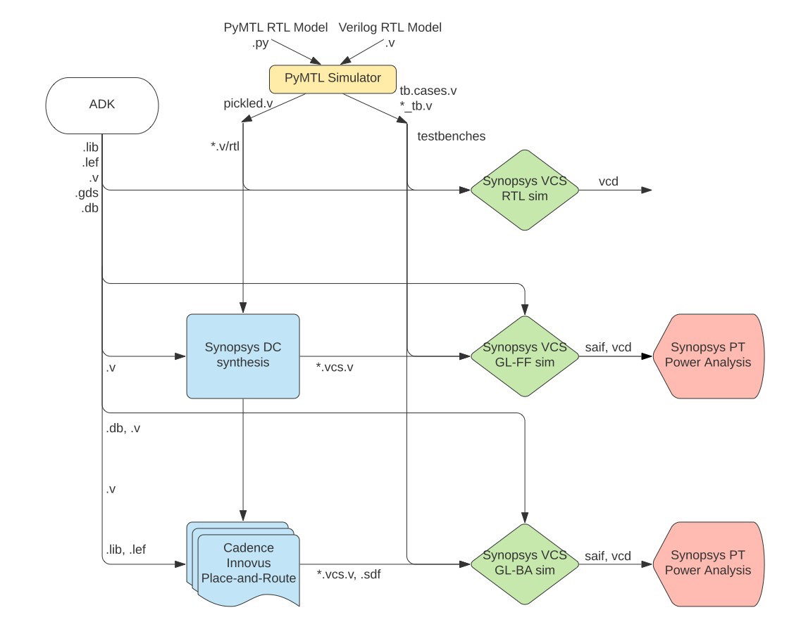

ECE 5745 Section 2: ASIC Flow Back-End
==========================================================================

 - Author: Christopher Batten & Khalid Al-Hawaj
 - Date: January 31, 2020

**Table of Contents**

 - Introduction
 - NanGate 45nm Standard-Cell Libraries
 - Revisiting the ASIC Flow Front-End
 - Using Cadence Innovus for Place-and-Route
 - Automating the ASIC Flow (mflowgen)

Introduction
--------------------------------------------------------------------------

In this section, we will be discussing the back-end of the ASIC toolflow.
More detailed tutorials will be posted on the public course website
shortly, but this section will at least give you a chance to take a
gate-level netlist through place-and-route and energy analysis. The
following diagram illustrates the four primary tools we will be using in
ECE 5745 along with a few smaller secondary tools. Notice that the
Synopsys and Cadence ASIC tools all require various views from the
standard-cell library.

The "back-end" of the flow is highlighted in red and refers to Cadence
Innovus and Synopsys PrimeTime:

 - We use Cadence Innovus to place-and-route our design, which means to
   place all of the gates in the gate-level netlist into rows on the chip
   and then to generate the metal wires that connect all of the gates
   together. We need to provide Cadence Innovus with similar abstract
   logical and timing views used in Synopsys DC. Cadence Innovus takes
   as input the `.lib` file which is the ASCII text version of a `.db`
   file. In addition, we need to provide Cadence Innovus with technology
   information in `.lef` and `.captable` format and abstract physical
   views of the standard-cell library in `.lef` format. Cadence Innovus
   will generate an updated Verilog gate-level netlist, a `.spef` file
   which contains parasitic resistance/capacitance information about all
   nets in the design, and a `.gds` file which contains the final layout.
   The `.gds` file can be inspected using the open-source Klayout GDS
   viewer. Cadence Innovus also generates reports which can be used to
   accurately characterize area and timing.

 - We use Synopsys PrimeTime (PT) to perform power-analysis of our
   design. We need to provide Synopsys PT with the same abstract logical,
   timing, and power views used in Synopsys DC and ICC, but in addition
   we need to provide switching activity information for every net in the
   design (which comes from the `.saif` file), capacitance information
   for every net in the design (which comes from the `.sbpf` file), and a
   file which maps high-level RTL names to low-level gate-level names
   (which comes from the `.namemap` file). Synopsys PT puts the switching
   activity, capacitance, clock frequency, and voltage together to
   estimate the power consumption of every net and thus every module in
   the design, and these estimates are captured in various reports.

In this section, we will be focusing on just using Cadence Innovus to
place and route our design. Extensive documentation is provided by
Synopsys and Cadence. We have organized this documentation and made it
available to you on the [public course
webpage](http://www.csl.cornell.edu/courses/ece5745/syndocs). The
username/password was distributed during lecture.

The first step is to start MobaXterm. From the _Start_ menu, choose
_MobaXterm Educational Edition > MobaXterm Educational Edition_. Then
double click on _ecelinux.ece.cornell.edu_ under _Saved sessions_ in
MobaXterm. Log in using your NetID and password. Click _Yes_ when asked
if you want to save your password. This will make it easier to open
multiple terminals if you need to.

Once you are at the `ecelinux` prompt, source the setup script, clone
this repository from GitHub, and define an environment variable to keep
track of the top directory for the project.

    % source setup-ece5745.sh
    % mkdir $HOME/ece5745
    % cd $HOME/ece5745
    % git clone https://github.com/cornell-ece5745/ece5745-S02-back-end
    % cd ece5745-S02-back-end
    % TOPDIR=$PWD

NanGate 45nm Standard-Cell Libraries
--------------------------------------------------------------------------

Recall that a standard-cell library is a collection of combinational and
sequential logic gates that adhere to a standardized set of logical,
electrical, and physical policies. For example, all standard cells are
usually the same height, include pins that align to a predetermined
vertical and horizontal grid, include power/ground rails and nwells in
predetermined locations, and support a predetermined number of drive
strengths. In this course, we will be using the a NanGate 45nm
standard-cell library. It is based on a "fake" 45nm technology. This
means you cannot actually tapeout a design using this standard cell
library, but the technology is representative enough to provide
reasonable area, energy, and timing estimates for teaching purposes. All
of the files associated with this standard cell library are located in
the `$ECE5745_STDCELLS` directory.

Let's look at some layout for the standard cell library just like we did
in the last section.

    % klayout -l $ECE5745_STDCELLS/klayout.lyp $ECE5745_STDCELLS/stdcells.gds

Let's look at a 3-input NAND cell, find the NAND3_X1 cell in the
left-hand cell list, and then choose _Display > Show as New Top_ from the
menu. We will learn more about layout and how this layout corresponds to
a static CMOS circuit later in the course. The key point is that the
layout for the standard cells are the basic building blocks that we will
be using to create our ASIC chips.

The Synopsys and Cadence tools do not actually use this layout directly;
it is actually _too_ detailed. Instead these tools use abstract views of
the standard cells, which capture logical functionality, timing,
geometry, and power usage at a much higher level. In the last section, we
looked at Verilog and `.lib` views. The back-end flow takes as input the
`.lib` view for logical timing information, but it also takes as input a
`.lef` view which contains _physical_ information about the standard
cell. Let's look at the LEF for the 3-input NAND cell.

    % less -p NAND3_X1 $ECE5745_STDCELLS/stdcells.lef

The `.lef` view includes information about the size of the standard cell,
but also includes information about where every pin is physically
located. You can use Klayout to view `.lef` files as well. Start Klayout
like this:

    % klayout

Choose _File > Import > LEF_ from the menu. Navigate to the `cells.lef`
file which is located here:

    /classes/ece5745/install/adk-pkgs/freepdk-45nm/stdview/stdcells.lef

Let's look at a 3-input NAND cell, find the NAND3_X1 cell in the
left-hand cell list, and then choose _Display > Show as New Top_ from the
menu. The `.lef` file does not contain any transistor-level information.
It only contains information relevant to placement and routing.

In addition to physical information about each standard cell, the
back-end flow also needs to take as input general information about the
technology. This information is contained in two files:

    % less $ECE5745_STDCELLS/rtk-tech.lef
    % less $ECE5745_STDCELLS/rtk-typical.captable

The first provides information about the geometry and orientation of
wires for each metal layer. The second provides information about the
resistance and capacitance of each metal layer.

Now that we have looked at the physical views of the standard cell
library, we can now try using these views and the ASIC flow back-end to
place and route a gate-level netlist.

Revisiting the ASIC Flow Front-End
--------------------------------------------------------------------------

As in the last section, we will be using the following four-stage
registered incrementer as our example design:

Before we can place and route a gate-level netlist, we need to synthesize
that netlist. This is what we learned about in the last section. Here are
the steps to generate the Verilog using PyMTL and synthesize the design
using Synopsys DC.

### Test, Simulate, and Translate the Four-Stage Registered Incrementer

Always run the tests before pushing anything through the ASIC flow. There
is no sense in running the flow if the design is incorrect!

    % mkdir $TOPDIR/sim/build
    % cd $TOPDIR/sim/build
    % py.test ../regincr

Next we should rerun all the tests with the `--test-verilog` command line
option to ensure that the design also works after translated into
Verilog. You should do this step even if you are using Verilog for your
RTL design.

    % cd $TOPDIR/sim/build
    % py.test ../regincr --test-verilog

The tests are for verification. When we push a design through the flow we
want to use a simulator which is focused on evaluation. You can run the
simulator for our four-stage registered incrementer like this:

    % cd $TOPDIR/sim/build
    % ../regincr/regincr-sim 10 20 30 40
    % more RegIncrNstageRTL_4stage.v

You should now have the Verilog that we want to push through the ASIC
flow.

### Synthesize Verilog RTL to a Verilog Gate-Level Netlist

We start by creating a subdirectory for our work, and then launching
Synopsys DC.

    % mkdir -p $TOPDIR/asic-manual/synopsys-dc
    % cd $TOPDIR/asic-manual/synopsys-dc
    % dc_shell-xg-t

Enter the following commands which were explained in the last discussion
section:

    dc_shell> set_app_var target_library "$env(ECE5745_STDCELLS)/stdcells.db"
    dc_shell> set_app_var link_library   "* $env(ECE5745_STDCELLS)/stdcells.db"
    dc_shell> analyze -format sverilog ../../sim/build/RegIncrNstageRTL_4stage.v
    dc_shell> elaborate RegIncrNstageRTL_4stage
    dc_shell> check_design
    dc_shell> create_clock clk -name ideal_clock1 -period 1
    dc_shell> compile
    dc_shell> write -format verilog -hierarchy -output post-synth.v
    dc_shell> write -format ddc     -hierarchy -output post-synth.ddc
    dc_shell> exit

Take a few minutes to examine the resulting Verilog gate-level netlist.
Notice that the module hierarchy is preserved.

    % less post-synth.v

This is the gate-level netlist that we now want to place and route.

Using Cadence Innovus for Place-and-Route
--------------------------------------------------------------------------

We will be running Cadence Innovus in a separate directory to keep the
input and output files separate.

    % mkdir -p $TOPDIR/asic-manual/cadence-innovus
    % cd $TOPDIR/asic-manual/cadence-innovus

Before starting Cadence Innovus, we need to create two files which will
be loaded into the tool. The first file is a `.sdc` file which contains
timing constraint information about our design. This file is where we
specify our target clock period, but it is also where we could specify
input or output delay constraints (e.g., the output signals must be
stable 200ps before the rising edge). Use Geany or your favorite text
editor to create a file named `constraints.sdc` in
`$TOPDIR/asic-manual/cadence-innovus` with the following content:

    create_clock clk -name ideal_clock -period 1

The `create_clock` command is similar to the command we used in
synthesis, and usually, we use the same target clock period that we used
for synthesis. In this case, we are targeting a 1GHz clock frequency
(i.e., a 1ns clock period).

The second file is a "multi-mode multi-corner" (MMMC) analysis file. This
file specifies what "corner" to use for our timing analysis. A corner is
a characterization of the standard cell library and technology with
specific assumptions about the process temperature, and voltage (PVT). So
we might have a "fast" corner which assumes best-case process
variability, low temperature, and high voltage, or we might have a "slow"
corner which assumes worst-case variability, high temperature, and low
voltage. To ensure our design worked across a range of operating
conditions, we need to evaluate our design across a range of corners. In
this course, we will keep things simple by only considering a "typical"
corner (i.e., average PVT). Use Geany or your favorite text editor to
create a file named `setup-timing.tcl` in
`$TOPDIR/asic-manual/cadence-innovus` with the following content:

    create_rc_corner -name typical \
       -cap_table "$env(ECE5745_STDCELLS)/rtk-typical.captable" \
       -T 25

    create_library_set -name libs_typical \
       -timing [list "$env(ECE5745_STDCELLS)/stdcells.lib"]

    create_delay_corner -name delay_default \
       -early_library_set libs_typical \
       -late_library_set libs_typical \
       -rc_corner typical

    create_constraint_mode -name constraints_default \
       -sdc_files [list constraints.sdc]

    create_analysis_view -name analysis_default \
       -constraint_mode constraints_default \
       -delay_corner delay_default

    set_analysis_view \
       -setup [list analysis_default] \
       -hold [list analysis_default]

The `create_rc_corner` command loads in the `.captable` file that we
examined earlier. This file includes information about the resistance and
capacitance of every metal layer. Notice that we are loading in the
"typical" captable and we are specifying an "average" operating
temperature of 25 degC. The `create_library_set` command loads in the
`.lib` file that we examined in the last section. This file includes
information about the input/output capacitance of each pin in each
standard cell along with the delay from every input to every output in
the standard cell. The `create_delay_corner` specifies a specific corner
that we would like to use for our timing analysis by putting together a
`.captable` and a `.lib` file. In this specific example, we are creating
a typical corner by putting together the typical `.captable` and typical
`.lib` we just loaded. The `create_constraint_mode` command loads in the
`.sdc` file we mentioned earlier in this section. The
`create_analysis_view` command puts together constraints with a specific
corner, and the `set_analysis_view` command tells Cadence Innovus that we
would like to use this specific analysis view for both setup and hold
time analysis.

Now that we have created our `constraints.sdc` and `setup-timing.tcl`
files we can start Cadence Innovus:

    % innovus -64

This will launch the GUI. We can enter commands in the terminal and watch
the effect of these commands on our design in the GUI. We need to set
various variables before starting to work in Cadence Innovus. These
variables tell Cadence Innovus the location of the MMMC file, the
location of the Verilog gate-level netlist, the name of the top-level
module in our design, the location of the `.lef` files, and finally the
names of the power and ground nets.

    innovus> set init_mmmc_file "setup-timing.tcl"
    innovus> set init_verilog   "../synopsys-dc/post-synth.v"
    innovus> set init_top_cell  "RegIncrNstageRTL_4stage"
    innovus> set init_lef_file  "$env(ECE5745_STDCELLS)/rtk-tech.lef $env(ECE5745_STDCELLS)/stdcells.lef"
    innovus> set init_gnd_net   "VSS"
    innovus> set init_pwr_net   "VDD"

We can now use the `init_design` command to read in the verilog, set the
design name, setup the timing analysis views, read the technology `.lef`
for layer information, and read the standard cell `.lef` for physical
information about each cell used in the design.

    innovus> init_design

We start by working on power planning which is the process of routing the
power and ground signals across the chip. First, we use the `floorPlan`
command to set the dimensions for our chip.

    innovus> floorPlan -su 1.0 0.70 4.0 4.0 4.0 4.0

In this example, we have chosen the aspect ration to be 1.0, the target
cell utilization to be 0.7, and we have added 4.0um of margin around the
top, bottom, left, and right of the chip. This margin gives us room for
the power ring which will go around the entire chip.

Often when working with the ASIC flow back-end, we need to explicitly
tell the tools how the logical design connects to the physical aspects of
the chip. For example, the next step is to tell Cadence Innovus that
`VDD` and `VSS` in the gate-level netlist correspond to the physical pins
labeled `VDD` and `VSS` in the `.lef` files.

    innovus> globalNetConnect VDD -type pgpin -pin VDD -inst * -verbose
    innovus> globalNetConnect VSS -type pgpin -pin VSS -inst * -verbose

The next step in power planning is to draw M1 wires for the power and
ground rails that go along each row of standard cells.

    innovus> sroute -nets {VDD VSS}

Now we create a power ring around our chip using the `addRing` command. A
power ring ensures we can easily get power and ground to all standard
cells. The command takes parameters specifying the width of each wire in
the ring, the spacing between the two rings, and what metal layers to use
for the ring.

    innovus> addRing -nets {VDD VSS} -width 0.6 -spacing 0.5 \
                     -layer [list top 7 bottom 7 left 6 right 6]

We have power and ground rails along each row of standard cells and a
power ring, so now we need to hook these up. We can use the `addStripe`
command to draw wires and automatically insert vias whenever wires cross.
First we draw the vertical "stripes".

    innovus> addStripe -nets {VSS VDD} -layer 6 -direction vertical \
                       -width 0.4 -spacing 0.5 -set_to_set_distance 5 -start 0.5

And then we draw the horizontal "stripes".

    innovus> setAddStripeMode -stacked_via_bottom_layer 6 \
                       -stacked_via_top_layer    7

    innovus> addStripe -nets {VSS VDD} -layer 7 -direction horizontal \
                       -width 0.4 -spacing 0.5 -set_to_set_distance 5 -start 0.5

Now that we have finished our basic power planning we can do the initial
placement and routing of the standard cells using the `place_design`
command:

    innovus> place_design

You should be able to see the standard cells placed in the rows along
with preliminary routing to connect all of the standard cells together.
You can toggle the visibility of metal layers by pressing the number keys
on the keyboard. So try toggling the visibility of M1, M2, M3, etc. You
can visualize how the modules in the original Verilog mapped to the
place-and-routed design by using the Design Browser. Choose the _Windows
> Workspaces > Design Browser + Physical_ menu option. Then use the
_Design Browser_ to click on specific modules or nets to highlight them
in the physical view.

The `place_design` command will perform a very preliminary route to help
ensure a good placement, but we will now do a more detailed routing pass
for the clock and signals to improve the quality of results. The
`cccopt_design` command will do clock tree synthesis optimization to
improve the quality of the clock tree (e.g., less clock skew across the
chip). Before running the command make sure you can see the physical view
of the chip, and then watch how the clock net changes after the command
is complete. You can choose to just show the clock by changing the
visibility of nets in the right-hand panel.

    innovus> ccopt_design

We can use the `routeDesign` to do detailed timing-driven routing of all
of the signals. As before, make sure you watch the physical view to see
the result before and after running this command. You should be able to
appreciate that the final result requires fewer and shorter wires.

    innovus> routeDesign

The final step is to insert "filler" cells. Filler cells are essentially
empty standard cells whose sole purpose is to connect the wells across
each standard cell row.

    innovus> setFillerMode -corePrefix FILL -core "FILLCELL_X4 FILLCELL_X2 FILLCELL_X1"
    innovus> addFiller

Now we are basically done! Obviously there are many more steps required
before you can really tape out a chip. We would need to add an I/O ring
to connect the chip to the package, we would need to do further
verification, and additional optimization.

For example, one thing we want to do is verify that the gate-level
netlist matches what is really in the final layout. We can do this using
the `verifyConnectivity` command. We can also do a preliminary "design
rule check" to make sure that the generated metal interconnect does not
violate any design rules with the `verify_drc` command.

    innovus> verifyConnectivity
    innovus> verify_drc

Now we can generate various artifacts. We might want to save the final
gate-level netlist for the chip since Cadence Innovus will often insert
new cells or change cells during its optimization passes.

    innovus> saveNetlist post-par.v

We can also extract resistance and capacitance for the metal
interconnect and write this to a special `.spef` file. This file can be
used for later timing and/or power analysis.

    innovus> extractRC
    innovus> rcOut -rc_corner typical -spef typical.spef

And of course the step is to generate the real layout as a `.gds` file.
This is what we will send to the foundry when we are ready to tapeout the
chip.

    innovus> streamOut post-par.gds \
               -merge "$env(ECE5745_STDCELLS)/stdcells.gds" \
               -mapFile "$env(ECE5745_STDCELLS)/rtk-stream-out.map"

We can also use Cadence Innovus to do timing, area, and power analysis
similar to what we did with Synopsys DC. These post-place-and-route
results will be _much_ more accurate than the preliminary post-synthesis
results.

    innovus> report_timing
    innovus> report_area
    innovus> report_power -hierarchy all

Finally, we go ahead and exit Cadence Innovus.

    innovus> exit

If you want you can open up the final layout using Klayout.

    % klayout -l $ECE5745_STDCELLS/klayout.lyp post-par.gds

Choose _Display > Full Hierarchy_ from the menu to display the entire
design. Zoom in and out to see the individual transistors as well as the
entire chip.

Automating the ASIC Flow
--------------------------------------------------------------------------

Our approach so far has enabled us to see the key tools used for the ASIC
flow front- and back-end, but we have been entering commands manually for
each tool. This is obviously very tedious and error prone. An agile
hardware design flow demands automation to simplify rapidly exploring the
area, energy, timing design space of one or more designs. Luckily,
Synopsys and Cadence tools can be easily scripted using TCL, and even
better, the ECE 5745 staff have already created these TCL scripts along
with a set of Makefiles to run thee TCL scripts.

The automated flow is located in the `mflowgen` subdirectory of this repo.
Take a look at the `designs` subdirectory. In the subdirectory, you should
see a directory already created for `RegIncr`, which holds all the
configuration required to derive the flow. Take the time to inspect the
file `construct.py`, which describes the desired flow to be ran.
As an input, the flow expects the file `design.v` to be placed inside
`rtl/outputs`. You can execute the following commands to inspect the
structure of the directory:

  % cd mflowgen/designs/RegIncr
  % tree ./

Inside the `construct.py` file, there are a lot of information, but the
important configuration is placed at the top of the file:

  #-----------------------------------------------------------------------
  # Parameters
  #-----------------------------------------------------------------------

  adk_name = 'freepdk-45nm'
  adk_view = 'view-standard'

  parameters = {
    'construct_path' : __file__,
    'design_name'    : 'RegIncr4stageRTL',
    'clock_period'   : 2.0,
    'adk'            : adk_name,
    'adk_view'       : adk_view,
    'topographical'  : True,
  }

The `adk_name` specifies the targeted technology node and fabrication
process. The `design_name` is the name of the corresponding top-level
module. The `clock_period` is the target clock period we want to use for
synthesis and place-and-route.

To get started create a build directory and run the configure script. You
need to explicitly specify which design you want to push through the flow
when you run the configure script.

    % cd $TOPDIR/mflowgen
    % mkdir build
    % cd build
    % ../configure --design ../designs/RegIncr
    % make list

The `list` Makefile target will display the various targets that you can
use to manage the flow. The following two commands will perform synthesis
and then place-and-route.

    % cd $TOPDIR/asic/build
    % make synopsys-dc-synthesis
    % make cadence-innovus-place-route

It will take 4-5 minutes to push the design through the flow. The
automated flow takes longer than the manual steps we used above because
the automated flow is using a much more sophisticated approach with many
more optimization steps. Be aware that for larger designs it can take
quite a while to push a design through the entire flow. Consider using
just the ASIC flow front-end to ensure your design is synthesizable and
to gain some rough early intuition on area and timing. Then you can
iterate quickly and eventually focus on the ASIC flow back-end.

You can use the `debug-` targets to view the final design in Cadence
Innovus.

    % make debug-cadence-innovus-place-route

*To Do On Your Own:* Modify the `construct.py` file to target a much
more aggressive clock period of only 300ps. Use the automated ASIC flow
to push the four-stage registered incrementer through the flow again.
Then use `debug-cadence-innovus-place-route` to bring the final deisgn
up in Cadence Innovus. Explore the design to see how the tool has placed
and routed the more complex incrementers. Use the `report_timing` and
`report_area` commands to look at the critical path and area.
